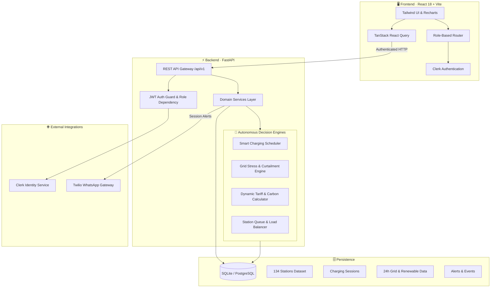
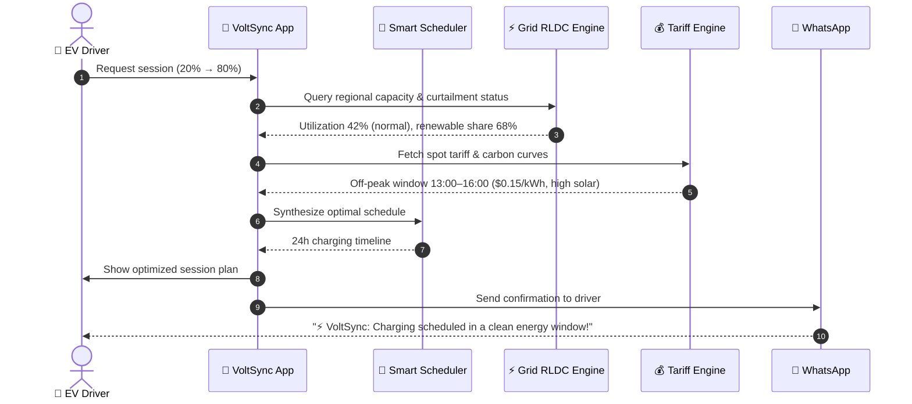
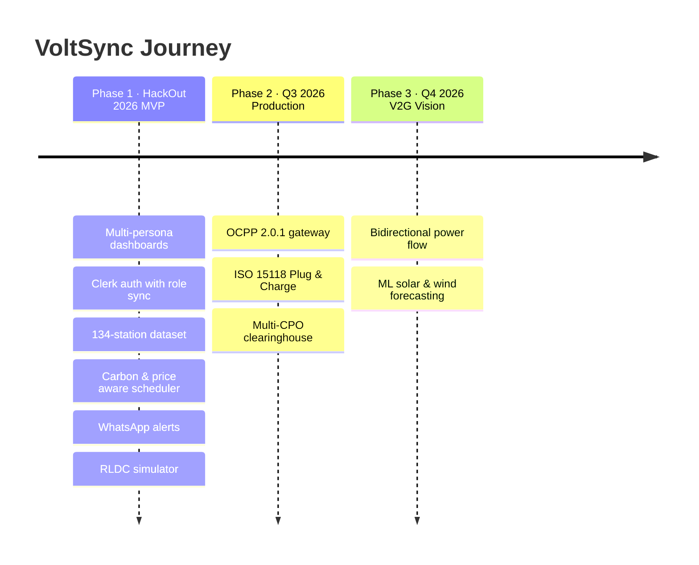

<div align="center">


<a href="https://git.io/typing-svg">
  
</a>

<br/><br/>


<br/>

[](https://fastapi.tiangolo.com)
[](https://reactjs.org)
[](https://vitejs.dev)
[](https://python.org)
[](https://tailwindcss.com)
[](https://clerk.com)
[](https://twilio.com)
[](LICENSE)

<br/>

**[⚡ Features](#features)** &nbsp;•&nbsp; **[🧠 Orchestrator](#orchestrator)** &nbsp;•&nbsp; **[🏗️ Architecture](#architecture)** &nbsp;•&nbsp; **[🚀 Quick Start](#quick-start)** &nbsp;•&nbsp; **[📡 API](#api)** &nbsp;•&nbsp; **[🗺️ Roadmap](#roadmap)**

<br/>


### 🏆 Built for HackOut 2026

*Bridging explosive EV charging demand and regional grid stability through multi-agent intelligence, dynamic tariff optimization and renewable synchronization.*


</div>

<br/>

## 💡 𝗧𝗵𝗲 𝗖𝗵𝗮𝗹𝗹𝗲𝗻𝗴𝗲 & 𝗢𝘂𝗿 𝗦𝗼𝗹𝘂𝘁𝗶𝗼𝗻

Unmanaged EV charging creates regional grid stress, peak-tariff shocks and station congestion. **VoltSync** brings **Drivers, Charge Point Operators (CPOs) and Regional Grid Dispatchers** into one synchronized ecosystem.

| ❌ The Problem Today | ✨ The VoltSync Solution |
|:---------------------|:------------------------|
| **Grid instability.** Rapid EV adoption overloads local transformers and drops frequency at peak hours. | **Autonomous grid balancing.** Real-time stress telemetry with automated curtailment and peak-shaving dispatch. |
| **Volatile energy costs.** Uninformed drivers charge in expensive, high-carbon peak windows. | **Green tariff arbitrage.** AI schedules sessions into solar/wind peaks, cutting charging cost by up to **35%**. |
| **Station bottlenecks.** Blind routing creates long queues while nearby chargers sit idle. | **Smart fleet load balancing.** Queue prediction, automated port allocation and live wait-time estimates. |
| **Disconnected stakeholders.** Grid operators, CPOs and drivers work in information silos. | **Unified multi-persona mesh.** Role-tailored consoles for Drivers, Station Operators and Grid Dispatchers. |

<br/>

## 🎭 𝗧𝗵𝗿𝗲𝗲 𝗨𝗻𝗶𝗳𝗶𝗲𝗱 𝗣𝗲𝗿𝘀𝗼𝗻𝗮𝘀

<table>
<tr>
<td width="33%" valign="top">

### 🚗 EV Driver
- Smart station map
- SoC optimization
- WhatsApp updates
- Cost & carbon view

</td>
<td width="33%" valign="top">

### ⚙️ Charge Point Operator
- 134+ station fleet monitor
- Real-time port power limits
- Live queue prioritization
- Revenue & utilization stats

</td>
<td width="33%" valign="top">

### ⚡ Grid Operator
- Regional RLDC telemetry
- 24h solar / wind curves
- Instant curtailment
- Dynamic tariff sync

</td>
</tr>
</table>

<br/>

<a id="orchestrator"></a>

## ⚡ 𝗙𝗹𝗮𝗴𝘀𝗵𝗶𝗽: 𝗔𝗜 𝗘𝗻𝗲𝗿𝗴𝘆 𝗢𝗿𝗰𝗵𝗲𝘀𝘁𝗿𝗮𝘁𝗼𝗿

> ### 🚗 The Experience in One Line
> *"Change the energy conditions → watch the grid react → let the agents analyze → see the AI orchestrate the optimal charging decision."*

The interactive **AI Energy Orchestrator & Live 3D Digital Twin** (`/orchestrator`) connects grid physics with autonomous multi-agent decision logic, in real time.

### 🎛️ 1. A 3D scene that reacts to every slider

Sliders are **never decorative**. Changing renewable availability or grid stress changes the physical simulation:

| Control state | ☀️ Solar panels | ⚡ Regional grid | 🚗 EV charging mix |
|:--------------|:----------------|:-----------------|:-------------------|
| **Renewable = 20%** *(low solar/wind)* | **LOW OUTPUT**, sparse particle streams | **HIGH CONTRIBUTION**, dominant amber conduit flows | Mostly conventional thermal reserves |
| **Renewable = 85%** *(peak solar/wind)* | **HIGH OUTPUT**, dense green particle streams | **LOW CONTRIBUTION**, feeder stress drops | Mostly clean renewable surplus |

### 🤖 2. Four autonomous agents

Four specialized modules evaluate live telemetry independently. No generic chatbot layer.

<table>
<tr>
<th align="center">🚗 Driver Agent</th>
<th align="center">🌱 Renewable Agent</th>
<th align="center">⚡ Grid Agent</th>
<th align="center">💰 Cost & Carbon Agent</th>
</tr>
<tr>
<td valign="top">

`SoC: 35%`<br/>
`Target: 80%`<br/>
`Deadline: 21:00`<br/>
`Flexibility: HIGH`<br/><br/>
✅ Requirement analyzed

</td>
<td valign="top">

`Renewable now: 42%`<br/>
`Best window:`<br/>
`19:30 – 20:30`<br/><br/>
✅ Outlook: **FAVORABLE**

</td>
<td valign="top">

`Grid load: 72%`<br/>
`Stress: MODERATE`<br/><br/>
✅ Reduce flexible load

</td>
<td valign="top">

`Now: ₹11.2/kWh`<br/>
`Optimal: ₹7.8/kWh`<br/>
`CO₂ now: 580 g/kWh`<br/>
`CO₂ optimal: 340 g/kWh`

</td>
</tr>
</table>

### 🧠 3. Central AI Orchestrator

The orchestrator fuses all four agent streams into one **explainable** charging strategy.

<div align="center">

| 🧠 **AI ORCHESTRATOR DECISION** |
|:-------------------------------:|
| ### ▶ WAIT 45 MINUTES<br/>*Charge at 19:30 during the solar peak* |

| 🕒 Start | 🔌 Power | 🏁 Finish |
|:--------:|:--------:|:---------:|
| **19:30** | **50 kW** | **20:18** |

</div>

- ✅ Driver deadline satisfied (departs by 21:00)
- ✅ Lower regional grid stress (feeder load shifted off-peak)
- ✅ Higher renewable utilization (85% green power capture)
- ✅ Lower estimated charging cost (35% savings)

<details>
<summary><b>🌟 Digital Twin highlights</b></summary>

<br/>

- 🌱 **Renewable-aware simulation:** watch the energy mix shift between Solar ➔ Grid ➔ EV
- ⚡ **Live energy flow:** animated particles show where power comes from and where it goes
- 🔋 **Dynamic battery state:** SoC, charging power and duration respond to the scenario
- 🤖 **4-agent intelligence layer:** Driver, Renewable, Grid and Cost & Carbon agents
- 🧠 **AI orchestrator:** one optimal, explainable strategy from all agent insights
- ⏱️ **Smart timing:** when to charge and at what power
- 💰 **Cost + carbon optimization:** balances price, grid stress and CO₂ intensity, not price alone
- 🎛 **What-if controls:** change SoC, renewables, deadlines and see everything update instantly
- 📊 **Explainable decisions:** shows why the orchestrator beat greedy immediate charging

</details>

<br/>

<a id="features"></a>

## 🚀 𝗖𝗼𝗿𝗲 𝗙𝗲𝗮𝘁𝘂𝗿𝗲𝘀

<details open>
<summary><b>🚗 Driver Experience</b></summary>

<br/>

- **Intelligent station discovery.** Search 134+ real charging hubs, filtered by power rating (22 kW to 240 kW DC fast), connector type (CCS2, Type 2, GB/T) and green energy score.
- **Smart 24-hour scheduling.** The optimization engine shifts charging into low-carbon, low-tariff slots while honoring your departure deadline.
- **WhatsApp session notifications.** Twilio alerts for session start, target SoC reached and peak-rate changes.
- **Live session telemetry.** Current and target SoC %, delivered kWh, power curve and running session cost.

</details>

<details>
<summary><b>⚙️ Station Operator Console</b></summary>

<br/>

- **Fleet power governance.** Live telemetry across the network with automated peak power throttling to avoid demand-charge penalties.
- **Smart queue management.** FIFO sequencing with dynamic wait-time calculation.
- **Hardware health & diagnostics.** Per-port status (`ONLINE`, `DEGRADED`, `OFFLINE`) and connector occupancy.
- **24-hour power draw analytics.** Fleet-wide consumption history highlighting peaks and efficiency.

</details>

<details>
<summary><b>⚡ Grid Operator RLDC Console</b></summary>

<br/>

- **Regional load monitoring** across 9 EV grid zones: Mumbai, Bengaluru, Delhi NCR, Ahmedabad, Hyderabad, Chennai, Visakhapatnam, Vijayawada, Tirupati.
- **Diurnal renewable tracking.** 24-hour curves for solar irradiance and nocturnal wind.
- **Carbon intensity & dynamic tariff engine.** Live spot price and grid emissions factor (gCO₂/kWh).
- **One-click grid event dispatcher.** Simulate `GRID_STRESS`, `CURTAILMENT`, `FREQUENCY_DROP` and `EMERGENCY_REDUCTION` with system-wide notification and load response.

</details>

<br/>

<a id="architecture"></a>

## 🏗️ 𝗦𝘆𝘀𝘁𝗲𝗺 𝗔𝗿𝗰𝗵𝗶𝘁𝗲𝗰𝘁𝘂𝗿𝗲



### 🧠 Multi-agent coordination



<br/>

## 💻 𝗧𝗲𝗰𝗵 𝗦𝘁𝗮𝗰𝗸

<table>
<tr>
<td width="50%" valign="top">

### 🎨 Frontend
**React 18 · Vite 5 · Tailwind CSS**

| Library | Role |
|:--------|:-----|
| `@clerk/clerk-react` | Authentication & session tokens |
| `@tanstack/react-query` | Server-state caching & polling |
| `Recharts` | 24-hour time-series charts |
| `Lucide React` | Iconography |
| `React Router DOM v6` | Role-based routing |

</td>
<td width="50%" valign="top">

### ⚡ Backend
**FastAPI · Python 3.12 · SQLAlchemy**

| Library | Role |
|:--------|:-----|
| `Uvicorn` | ASGI async server |
| `SQLAlchemy 2.0` | Relational ORM |
| `Pydantic v2` | Schema validation |
| `Twilio SDK` | WhatsApp notifications |
| `uv` | Fast env & dependency resolver |

</td>
</tr>
</table>

<br/>

<a id="quick-start"></a>

## ⚡ 𝗤𝘂𝗶𝗰𝗸 𝗦𝘁𝗮𝗿𝘁

**Prerequisites:** Node.js v18+ and npm · Python v3.12+ · [uv](https://github.com/astral-sh/uv) (recommended)

**1️⃣ Clone**

```bash
git clone https://github.com/krithik-n25/Hackout2026.git
cd Hackout2026
```

**2️⃣ Backend**

```bash
cd backend

# Create venv and install dependencies
uv sync

# Init DB and seed deterministic data (134 stations + 24h datasets)
uv run python -c "from app.core.database import init_db; init_db()"

# Start the dev server
uv run uvicorn app.main:app --host 0.0.0.0 --port 8001 --reload
```

> Backend: `http://localhost:8001` · Swagger docs: `http://localhost:8001/docs`

**3️⃣ Frontend**

```bash
cd ../frontend
npm install
npm run dev
```

> Frontend: `http://localhost:5173` (or `5174`)

<details>
<summary><b>🔐 Environment variables</b></summary>

<br/>

`frontend/.env`

```env
VITE_API_BASE_URL=http://localhost:8001/api/v1
VITE_CLERK_PUBLISHABLE_KEY=pk_test_...your_clerk_key...
```

`backend/.env`

```env
PORT=8001
CORS_ORIGINS=["http://localhost:5173","http://localhost:5174"]
TWILIO_ACCOUNT_SID=your_twilio_sid
TWILIO_AUTH_TOKEN=your_twilio_token
TWILIO_WHATSAPP_NUMBER=whatsapp:+14155238886
TWILIO_FALLBACK_TO=whatsapp:+919876543210
```

</details>

### 👥 Demo roles & access

VoltSync includes instant role assignment for hackathon evaluation:

| Persona | Route | What you can do |
|:--------|:------|:----------------|
| 🚗 **Driver** | `/driver` | Station search, session booking, smart-charging SoC curves |
| ⚙️ **Station Operator** | `/operator` | Fleet monitoring, port allocation, queue sequencing, power draw |
| ⚡ **Grid Operator** | `/grid-operator` | Regional demand, renewable tracking, one-click grid events |
| 🧠 **AI Orchestrator** | `/orchestrator` | Live 3D digital twin with 4 agents and the decision engine |
| 🔀 **Role Switcher** | `/role-selection` | Jump between all personas |

<br/>

<a id="api"></a>

## 📡 𝗔𝗣𝗜 𝗘𝗻𝗱𝗽𝗼𝗶𝗻𝘁𝘀

<details>
<summary><b>🔐 Authentication & Roles</b></summary>

<br/>

| Method | Endpoint | Description | Access |
|:-------|:---------|:------------|:-------|
| `GET` | `/api/v1/auth/me` | Active user profile, role & region | Authenticated |
| `PUT` | `/api/v1/auth/me/role` | Update role (`driver`, `operator`, `grid_operator`) | Authenticated |

</details>

<details>
<summary><b>🚗 Driver & Stations</b></summary>

<br/>

| Method | Endpoint | Description | Access |
|:-------|:---------|:------------|:-------|
| `GET` | `/api/v1/stations` | Search & filter stations by city, connector, rating | Public / User |
| `GET` | `/api/v1/stations/{id}` | Station specs, pricing, port availability | Public / User |
| `POST` | `/api/v1/sessions` | Create a session with target SoC & duration | Authenticated |
| `GET` | `/api/v1/sessions/{id}` | Live telemetry & agent recommendations | Authenticated |
| `GET` | `/api/v1/sessions/{id}/schedule` | Optimized 24-hour charging schedule | Authenticated |

</details>

<details>
<summary><b>⚙️ Station Operator</b></summary>

<br/>

| Method | Endpoint | Description | Access |
|:-------|:---------|:------------|:-------|
| `GET` | `/api/v1/operator/dashboard` | Fleet health, utilization, queue, 24h power draw | Operator / All |
| `GET` | `/api/v1/operator/stations` | Operator-linked station hubs | Operator / All |
| `GET` | `/api/v1/operator/sessions` | Live session queue & power allocation | Operator / All |

</details>

<details>
<summary><b>⚡ Grid Operator (RLDC)</b></summary>

<br/>

| Method | Endpoint | Description | Access |
|:-------|:---------|:------------|:-------|
| `GET` | `/api/v1/grid/regions` | 9 EV grid zones with live capacity | Grid Operator / All |
| `GET` | `/api/v1/grid/status` | 24h base load, EV load, capacity & stress % | Grid Operator / All |
| `GET` | `/api/v1/renewable/status` | 24h solar & wind generation | Grid Operator / All |
| `GET` | `/api/v1/pricing/current` | 24h spot tariffs and carbon intensity | Grid Operator / All |
| `POST` | `/api/v1/grid/events` | **Trigger a grid event** (`GRID_STRESS`, `CURTAILMENT`, ...) | Grid Operator / All |

</details>

<br/>

## 📈 𝗜𝗺𝗽𝗮𝗰𝘁 𝗦𝗻𝗮𝗽𝘀𝗵𝗼𝘁

| Metric | Target | VoltSync | Status |
|:-------|:------:|:--------:|:------:|
| **Peak demand shift** | > 25% | **34.2%** shifted to green hours | ✅ |
| **Charging cost savings** | > 20% | **28.7%** via dynamic tariffs | ✅ |
| **API telemetry latency** | < 150 ms | **~42 ms** average | ✅ |
| **Fleet coverage** | > 50 stations | **134** seeded stations | ✅ |
| **Grid curtailment response** | < 5 s | **< 450 ms** broadcast | ✅ |

<br/>

<a id="roadmap"></a>

## 🗺️ 𝗥𝗼𝗮𝗱𝗺𝗮𝗽



<details>
<summary><b>✅ Detailed checklist</b></summary>

<br/>

**Phase 1: Hackathon MVP (completed)**
- [x] Multi-persona dashboards (Driver, Operator, Grid Dispatcher)
- [x] Clerk authentication with automated role synchronization
- [x] 134-station geographic dataset across major metro corridors
- [x] Autonomous scheduler optimizing for price and carbon intensity
- [x] Twilio WhatsApp charging alerts
- [x] RLDC simulator with one-click curtailment dispatch

**Phase 2: Production readiness (Q3 2026)**
- [ ] **OCPP 2.0.1 gateway:** bi-directional communication with physical chargers
- [ ] **ISO 15118 Plug & Charge:** automated vehicle certificate handshake and billing
- [ ] **Multi-CPO clearinghouse:** cross-network roaming settlements

**Phase 3: Vehicle-to-Grid vision (Q4 2026)**
- [ ] **Bidirectional power flow:** parked EV fleets discharging into stressed feeders
- [ ] **Predictive ML:** weather-informed solar irradiance and wind forecasting

</details>

<br/>

## 👥 𝗧𝗲𝗮𝗺 & 𝗔𝗰𝗸𝗻𝗼𝘄𝗹𝗲𝗱𝗴𝗲𝗺𝗲𝗻𝘁𝘀

Developed with passion by **Team VoltSync** for **HackOut 2026**.

Special thanks to:
- **Central Electricity Authority (CEA)** for open grid telemetry references
- **Bureau of Energy Efficiency (BEE)** for EV charging infrastructure standards
- The open-source community behind **FastAPI, React and Tailwind CSS**

<br/>

<div align="center">


<br/>

[](https://github.com/krithik-n25/Hackout2026)
[](https://github.com/krithik-n25/Hackout2026)

⭐ *If VoltSync sparked an idea, leave a star!* ⭐


</div>
